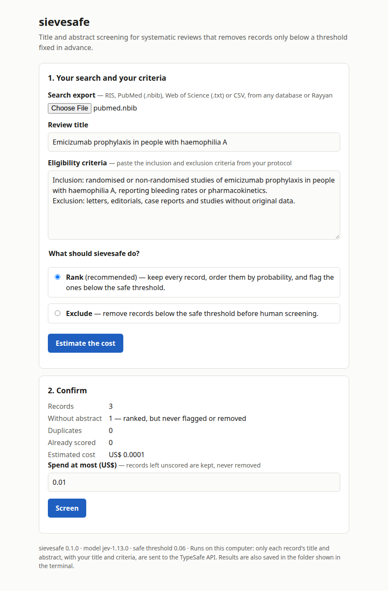

# sievesafe

[](LICENSE)
[](pyproject.toml)
[](pyproject.toml)

Title and abstract screening for systematic reviews that removes records only below a threshold fixed in advance.

You give it your search export and your eligibility criteria. For each record it estimates how likely it is that the
record should go on to full-text review. It needs no training data and no labelled examples. Then it works in one of two
modes:

- **rank** (the default) keeps every record, puts the most likely ones first and flags the ones below a safe threshold;
- **exclude** (opt-in) removes the records below that threshold before human screening, and hands you a random sample
  of them so you can check the result on your own review.

In both modes your records come back in the format they came in, ready to import into Rayyan, Covidence, EndNote or
Zotero, together with a report that gives the PRISMA 2020 count and a draft methods paragraph.

<picture>
  <source media="(prefers-color-scheme: dark)" srcset="docs/serve-dark.png">
  
</picture>

## What it promises, and what it doesn't

The safe threshold was set on 20 reviews and then tested, without any change, on 23 other reviews and on Cochrane
reviews from a second collection, CLEF TAR. Across all of them it lost one finally included study, in one review,
while a large share of the records fell below it. That record is a cardiology paper listed as included in a review about
colorectal cancer, and the review itself does not cite it, while it cites the other 48 included studies
([`label-check.md`](benchmark/external/label-check.md)). So it is probably a labelling mistake, but that CLEF set still
failed the rule we had fixed for it. In the benchmarks, the records it removed rarely contained a study that ended up in the review.

It does not promise to match human title and abstract screening. Some records that human screeners sent on to full
text do fall below the threshold. In the benchmark all of them were later excluded at full text, but a benchmark is not
a guarantee for your review, so check exclude mode on your own data before relying on it, as the RAISE recommendations
ask.

<!-- benchmark:start (generated by benchmark/results.py) -->

| on 23 held-out SYNERGY+ reviews (33,001 records) | sievesafe (zero-shot, no labels) | ASReview 3.0.8 (active learning, 1+1 labelled priors) |
|:--|--:|--:|
| work saved at 95% recall (median WSS@95) | **0.758** | 0.723 |
| work saved at 100% recall (median WSS@100) | **0.791** | 0.711 |
| reviews where sievesafe saves as much or more (WSS@95 / WSS@100) | 18/23 / 18/23 | |

| safe threshold (0.06), frozen on 20 other reviews | |
|:--|--:|
| records below it (flagged in rank mode, removed in exclude mode) | 29% of 33,001 |
| finally included studies below it | 0 of 597 (recall 100% in 23/23 reviews) |
| leave-one-review-out, 43 reviews: reviews keeping ≥98% / 100% of their includes | 43/43 / 42/43 (threshold 0.06–0.08; 95% upper bound on reviews losing any include: 11%) |
| records humans passed at title/abstract stage kept above it (12 reviews) | 96% on average (lowest 78%); of the rest, 0 finally included |
| run-to-run correlation of scores (model pinned) | 0.996 |
| cost | about US$ 0.05 per 1,000 records |

<!-- benchmark:end -->

After that, the threshold was tested again on CLEF TAR, still unchanged, with each analysis plan committed to git before
any record was scored ([`benchmark/external/`](benchmark/external/)):

<!-- external:start (generated by benchmark/external/evaluate.py) -->

| CLEF TAR Cochrane reviews, pre-specified plans, threshold 0.06 unchanged | Intervention (20 reviews), criteria: objectives and selection criteria | Intervention (20 reviews), criteria: objectives only | diagnostic test accuracy (8 reviews), criteria: objectives and selection criteria | 2017–2018 topics (40 reviews), criteria: objectives and selection criteria |
|:--|--:|--:|--:|--:|
| reviews keeping every finally included study | 18/18 | 18/18 | 8/8 | 38/39 |
| finally included studies kept | 510 of 510 | 510 of 510 | 250 of 250 | 848 of 849 |
| records below the threshold (weighted) | 52% | 34% | 45% | 49% |
| 95% upper bound on reviews losing any include | 15% | 15% | 31% | 12% |

<!-- external:end -->

WSS (work saved over sampling) is the share of records a reviewer can skip, reading in the tool's order, and still find
95% or 100% of the included studies. The numbers in these tables are written by the scripts in
[`benchmark/`](benchmark/) from public data and the model answers kept in the repository;
[`benchmark/results.md`](benchmark/results.md) has the full tables.

## Install

You need Python 3.11 or newer. From a clone of this repository, with [pipx](https://pipx.pypa.io):

```bash
pipx install .
```

sievesafe uses [TypeSafe](https://docs.typesafe.ai)'s Jev model, which needs a paid API key. Set it as an environment
variable (`TYPESAFE_API_KEY`) or keep it in a file:

```bash
mkdir -p ~/.config/sievesafe
echo 'TYPESAFE_API_KEY=your-key' > ~/.config/sievesafe/typesafe.env
chmod 600 ~/.config/sievesafe/typesafe.env
```

## Use

To work in the browser, start the local page. Nothing leaves your computer except what is sent to TypeSafe (see
[Limits](#limits)).

```bash
sievesafe serve
```

Or from the terminal:

```bash
sievesafe screen search.ris --criteria criteria.txt --title "Emicizumab prophylaxis in children with haemophilia A"
sievesafe screen search.ris --criteria criteria.txt --title "…" --mode exclude --budget 1.00
```

Before spending anything it tells you how many records there are and what they should cost, and asks you to confirm.
`--budget` is a limit in US$: a call is only sent if its estimated cost, added to what was spent and to the calls
still running, fits within it. Any record it could not score within the budget is kept at the top of the list and is
never removed. Running it again on the same file only pays for records that have not been scored yet.

It reads RIS (Scopus, Web of Science, Rayyan, EndNote, Zotero and others), PubMed/MEDLINE `.nbib`, Web of Science plain
text, and CSV or TSV files separated by `,` or `;` in the usual encodings. The results are written in the same format
and encoding:

| file | what it contains |
|:--|:--|
| `to-screen.<ext>` | the records for human screening, most likely first, left untouched |
| `ranked.csv` | rank, original position, probability, flag and title of every record |
| `excluded.<ext>` | exclude mode only: the records that were removed |
| `validation-sample.<ext>` | exclude mode only: 50 of the removed records, drawn at random, to screen as a local check |
| `report.md` | counts for the PRISMA 2020 diagram, a methods paragraph, the validation evidence and your criteria |

Records without an abstract are ranked but never flagged or removed, because the threshold was only validated on
records that had one. Duplicates (same DOI or title) are scored once and every copy is kept; removing duplicates is
still a job for your reference manager.

## Limits

- **Title and abstract stage only.** It does not read full texts, and it is tuned to let doubtful records through.
- **English-language literature.** Most of the benchmark reviews restricted their searches to English. Other languages
  have not been tested.
- **A paid, closed model.** Each record costs a fraction of a cent, and its title and abstract, along with your review
  title and criteria, are sent to TypeSafe's API. The model is proprietary. sievesafe pins the version the threshold was
  calibrated with (`jev-1.13.0`, the version current at the time); if that version is retired, the threshold has to be recalibrated, and
  [`benchmark/`](benchmark/) shows how.
- **Two benchmarks are not a guarantee.** SYNERGY+ and CLEF TAR are made of published reviews with published criteria.
  In the leave-one-review-out test one review lost one included study; in the external tests one review lost one, and
  the other three sets lost none. When we gave the model only the review's objectives, it removed fewer records but did not lose more
  studies; that is a single test, though.
- **A known flaw in how the threshold was set**, explained in [`benchmark/README.md`](benchmark/README.md). The corrected
  procedure gives a slightly higher threshold; sievesafe keeps the original, more cautious one.

## How it works

For each record, sievesafe asks Jev one yes/no question: should this record move on to full-text review for this
review? Jev is one of TypeSafe's System One models, which return a probability rather than generated text. The model
sees the review's title and criteria, the record's title and abstract, and a short policy saying that missing a relevant
study is much worse than reading an extra one. Answers are cached on disk by model, criteria and record text. The
threshold was set on 20 calibration reviews so that all of their included studies stayed above it.

## How to cite

Please cite the software using [`CITATION.cff`](CITATION.cff); GitHub's "Cite this repository" button turns it into APA
or BibTeX. A preprint describing the benchmark is on its way, and this section will link to it once it is posted.

## Help and contributing

For questions or bugs, open an issue in this repository. If you want to contribute, [`CONTRIBUTING.md`](CONTRIBUTING.md)
explains how to run the checks and why no number in the repository is typed by hand.

## License

AGPL-3.0-or-later.
